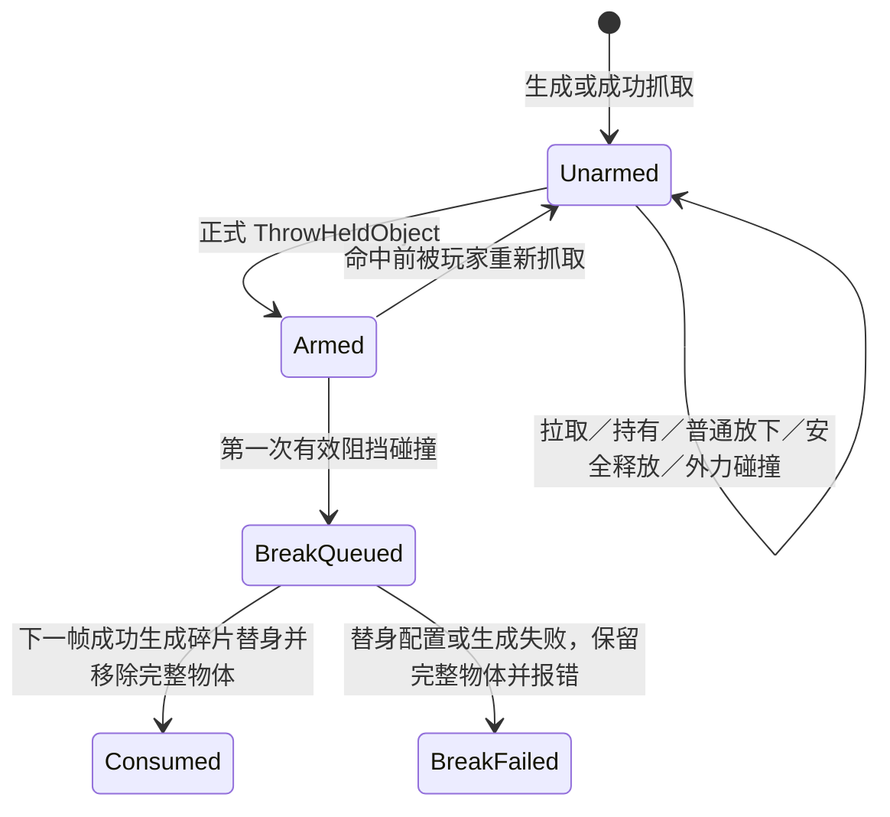

# 2026-08-10 磁力投掷物碰撞破碎实施计划

> 状态：方案已确认；用户已授权完整 Git 基线和首个 Geometry Collection 手工制作，尚未授权 C++、Blueprint 运行逻辑、材质或正式关卡装配。

## 1. 目标和优先级

### P0：本次必须先完成的最小闭环

当前磁力物只有在玩家执行**正式投掷**后才获得一次“下次有效碰撞可破碎”的资格：

1. 拉取、持有、普通放下、自动安全释放以及被其他物体撞击时都不破碎。
2. 正式投掷后，第一次有效阻挡碰撞触发破碎。
3. 完整物体在命中后替换成 Geometry Collection 碎片表现。
4. 所有碎片短暂停留后全部消失，完整物体不可再次抓取。
5. 同一次命中最多生成一次破碎表现。

这条闭环把磁力物明确做成一次性资源，也是本次唯一的玩法交付目标。

### P1：P0 验收后再讨论

大磁力物破碎时，普通碎片仍然消失，但额外生成一块独立的小磁力物；小磁力物还能再投掷一次，随后按 P0 路径彻底消耗。P1 不纳入第一阶段代码和资产范围，不提前增加使用次数、资源链或通用配置框架。

## 2. 当前工程证据

### 2.1 当前磁力物

2026-08-10 官方 UE MCP 回读确认：

- `/Game/ZeroEscape/Interaction/Magnetism/BP_MagneticProp` 的真实父类是项目中的 `/Script/Demo.MagneticPrototypeProp`。
- 根组件 `MagneticBody` 是可移动、模拟物理的 `UStaticMeshComponent`，碰撞类型为 `PhysicsBody`，使用 `PhysicsActor` 配置。
- 当前质量配置为 20 kg，Actor 和根组件都没有常驻 Tick。
- 当前网格为第三方素材 `/Game/Assets/SFCorridors/Meshes/SM_crate4`；约 80 × 80 × 80 cm，LOD0 为 492 个三角形、510 个顶点，共 2 个 LOD，只有 `crate4_MAT` 一个材质槽。

因此第一阶段不改造 `SM_crate4` 本身，也不让 Geometry Collection 参与拉取或持有。完整静态网格刚体继续承担现有抓取、碰撞和投掷；只有命中确认后才生成项目自有的破碎表现资产。

### 2.2 当前投掷边界

`Source/Demo/Private/Components/Magnetism/ElectromagneticGrabComponent.cpp` 已有明确分流：

- `EndGrabInput()` 和安全释放只调用普通释放，不进入正式投掷路径。
- 只有 `ThrowHeldObject()` 才计算目标速度、释放 Physics Handle、施加投掷冲量并添加项目中的 `AttackProjectile` Actor Tag。
- `AttackProjectile` 当前服务于目标受击识别，并会按既有计时移除；它不能同时充当破碎资格，因为两个职责的生命周期不同。

破碎资格必须是磁力物自身拥有的独立运行状态：正式投掷时写入；抓取成功时取消；有效命中时只消费一次。这样不会让追猎者受击 Tag 的计时误删破碎资格。

### 2.3 UE5.8 可用能力

本地 UE5.8 头文件只读核对确认，`UGeometryCollectionComponent` 提供：

- 用户指定的初始线速度和角速度，用于让碎片表现继承完整刚体的运动。
- `CrumbleActiveClusters()`，可显式拆开当前活动簇，适合 P0 的确定性“命中就全碎”。
- `ApplyExternalStrain()` 和 Physics Field 接口，可在后续需要局部破坏或分级破坏时使用。
- `bAllowRemovalOnBreak`，配合 Geometry Collection 资产中的 Remove On Break 数据移除已断开的碎片。

P0 不开启“受到任意碰撞自动损坏”，而是由项目状态机在命中确认后显式触发破碎。这样拉取途中即使撞墙，Geometry Collection 也尚未生成，不存在误碎路径。

## 3. 参考依据和取舍

- Valve Source SDK 2013 的物理道具会在重力枪正式发射时记录“发射后的第一次碰撞”，普通搬运与放下不进入该状态；破碎时生成碎块并移除完整道具。这是本方案“正式投掷资格 + 首次碰撞消费”的主要代码参考：<https://github.com/ValveSoftware/source-sdk-2013/blob/master/src/game/server/props.cpp>。
- 《Control》的 Launch 把环境物体当作空间弹药，支持“一次性场景资源”的玩法方向，但不作为本项目内部算法证据：<https://blog.playstation.com/2019/08/08/everything-we-learned-playing-the-first-2-hours-of-control/>。
- UE 官方 Destruction Quick Start 采用静态网格生成 Geometry Collection，并在命中时施加破坏输入：<https://dev.epicgames.com/documentation/unreal-engine/destruction-quick-start?lang=en-US>。
- UE 官方 Remove On Break 与 Chaos 优化资料支持小碎片在破碎后按计时移除；这对应 P0 的全部消失，也能支持未来 P1 的“小碎片消失、大块另行保留”：<https://dev.epicgames.com/documentation/en-us/unreal-engine/node-reference/Dataflow/RemoveOnBreak>、<https://dev.epicgames.com/documentation/unreal-engine/chaos-destruction-optimization?application_version=5.6>。

## 4. 核心运行流程

文中的 `Unarmed / Armed / BreakQueued` 是拟新增项目内部状态名，不是 UE 官方概念。直白含义分别是“当前不会碎”“已被正式投掷、下一次命中会碎”“已经记录命中、等待安全替换”。

### 4.1 抓取和普通释放

- `GrabCandidate()` 成功抓住候选刚体时，通过类型查找取得项目新增的破碎组件，并明确取消旧的投掷破碎资格。
- Pulling、Holding 和普通 `EndGrabInput()` 都不写入破碎资格。
- 持有路径撞到墙体、道具或角色时，破碎组件即使收到 Hit 也因状态不是 Armed 而直接忽略。
- 命中前如果玩家成功把已投掷物重新吸住，抓取成功立即取消资格；此后拉取途中不会因为旧投掷状态而破碎，下一次正式投掷再重新获得资格。

### 4.2 正式投掷

`ThrowHeldObject()` 保留当前投掷速度算法，只增加一个有类型约束的通知：

1. 保存待投掷刚体和 Actor。
2. 正常释放 Physics Handle 并恢复临时碰撞/阻尼。
3. 若 Actor 装有项目新增的 `UMagneticThrowBreakComponent`，调用一次 `ArmForFormalThrow()`。
4. 沿当前准星算法施加投掷冲量。
5. 保留现有 `AttackProjectile` Tag 及其受击生命周期，不让该 Tag 管理破碎状态。

未装破碎组件的其他磁力物维持当前行为，不会因为抓取组件更新而自动变成一次性物体。

### 4.3 第一次有效碰撞

P0 的有效条件保持直接、可预测：

- 破碎组件状态必须为 Armed。
- 命中必须来自该 Actor 的模拟物理根组件。
- `FHitResult` 必须是 Blocking Hit。
- 不设置最低速度或最低冲量门槛；“是否由正式投掷产生”已经是唯一玩法门槛，避免低速投掷碰墙却不消耗。

命中回调只完成以下工作：

1. 原子地把状态改为 BreakQueued，阻止同帧多次接触重复生成。
2. 记录命中位置和法线。
3. 安排下一帧执行替换，不在碰撞委托中立即销毁 Actor。

延后一帧的原因是保留当前 Actor、组件和 `AttackProjectile` Tag，确保追猎者或玩家的同帧受击监听能完整处理这次真实碰撞。原刚体在替换时读取碰撞后的最新 Transform、线速度和角速度，因此不会回跳到命中前位置。

### 4.4 完整物体替换为碎片

下一帧由破碎组件执行一次替换：

1. 校验原 Actor、模拟刚体和 `FractureActorClass`。
2. 读取原刚体当前 Transform、线速度和角速度。
3. 使用 deferred spawn 创建项目新增的 `AMagneticFractureActor` 派生 Blueprint。
4. 在完成生成前，把原刚体速度写入其 `UGeometryCollectionComponent` 初始速度。
5. 完成生成后，由破碎替身在物理状态可用时执行一次 `CrumbleActiveClusters()`，并在命中点施加有上限的小幅分离冲量。
6. 只有替身生成成功后才销毁完整磁力物；生成失败时保留完整物体、进入 BreakFailed 并输出一次明确错误，禁止“配置错误导致道具凭空消失”。

碎片替身不包含 `UMagneticObjectComponent`，也不继承 `AttackProjectile` Tag，所以碎片不能再次抓取、不能重复提交磁力投掷受击，只承担短暂 Chaos 表现。

## 5. C++ 职责设计

### 5.1 项目新增：`UMagneticThrowBreakComponent`

这是拟新增的项目类名，不是 UE 官方组件。它只负责某个磁力物的“正式投掷后首次命中破碎”状态和替换事务：

- 独占 `Unarmed / Armed / BreakQueued / Consumed / BreakFailed` 状态。
- 在 BeginPlay 校验 Owner 根组件是否为模拟物理的 `UPrimitiveComponent`，并按事件需要开启刚体 Hit 通知。
- 提供 `ArmForFormalThrow()` 与 `DisarmForGrab()` 两个窄入口。
- 监听根组件 Hit；不使用 Tick，不遍历世界，不依赖组件名或 Actor 名。
- 保存破碎替身 Blueprint 类和小幅分离速度等单物体配置。
- 替身生成成功后销毁 Owner；失败时保留 Owner 并停止重复尝试。

它不负责玩家抓取状态、不计算投掷速度、不控制目标受击，也不把 Geometry Collection 放进 Physics Handle。

### 5.2 项目新增：`AMagneticFractureActor`

这是只服务破碎表现的项目 Actor：

- 根组件为 `UGeometryCollectionComponent`。
- 默认开启组件级 `bAllowRemovalOnBreak`；Geometry Collection 资产仍必须写有每块叶子的 Remove On Break 数据，两者缺一不可。
- 接收原刚体 Transform、线速度、角速度、命中点和分离速度。
- 在 Geometry Collection 物理状态建立后事件式触发一次显式解簇；不常驻 Tick。
- 不包含磁性资格、使用次数、伤害或目标受击逻辑。
- 碎片实际移除时间由 Geometry Collection 资产的 Remove On Break 数据控制，避免每块碎片各开一个 Timer。

### 5.3 既有类的最小修改

- `UElectromagneticGrabComponent`：
  - 抓取成功时取消候选的旧破碎资格。
  - 只有 `ThrowHeldObject()` 正式投掷时才通知破碎组件进入 Armed。
  - 不把破碎状态并入既有 `EGrabPhase`，因为 GrabPhase 属于玩家抓取事务，而破碎资格属于道具自身。
- `AMagneticPrototypeProp`：创建 `UMagneticThrowBreakComponent` 默认子对象，让当前项目自有磁力原型具备可配置破碎能力；未配置替身类时明确禁用破碎，不使用隐藏兜底。
- `Demo.Build.cs`：预计只增加运行时 Geometry Collection 所需模块依赖；以 UE5.8 实际包含和链接结果为准，P0 不引入 Niagara。

## 6. 第一阶段资产制作方案

### 6.1 必须新建的项目自有资产

- `/Game/ZeroEscape/Interaction/Magnetism/Destruction/GC_MagneticCrate4_P0`
  - 从第三方 `SM_crate4` 生成的 Geometry Collection。
  - 第三方静态网格保持原样，不复制、不重命名、不改碰撞、不加材质槽。
- `/Game/ZeroEscape/Interaction/Magnetism/Destruction/BP_MagneticCrate4_Fracture`
  - 父类为项目新增的 `AMagneticFractureActor`。
  - 只装配 `GC_MagneticCrate4_P0` 和破碎表现参数，EventGraph 保持为空。
- 可选：`/Game/ZeroEscape/Interaction/Magnetism/Destruction/Materials/M_MagneticFractureInterior`
  - 若原网格切面明显发黑或透明，再创建简单的项目自有内部切面材质；P0 不修改第三方材质。

### 6.2 `SM_crate4` 的起始切片建议

首次 Fracture Mode 制作以“少而清楚”为准：

- 使用 Uniform Voronoi，先做约 12～16 块。
- 只保留一个根簇和叶子碎片，不做多级大/中/小破坏。
- 避免产生几厘米以下的大量细碎块；若出现，重新切片而不是靠运行时删除掩盖。
- P0 不启用碰撞自动破坏；破碎只接受 C++ 的显式解簇命令。
- 所有叶子碎片启用 Remove On Break。建议从破碎后 0.4～0.7 秒开始衰减，再用约 0.5～0.8 秒完成移除，使玩家先看见碎裂，再在约 1～1.5 秒内清空场地。
- 首轮只保留 Chaos 刚体碎片，不增加 Niagara 粉尘、音效、贴花和镜头震动。

这些数字只是首轮制作基线，最终以正常游戏镜头下的可读性和同时存在数量验证为准，不写死为玩法规则。

## 7. 文件与资产范围

### 7.1 预计新增 C++

- `Source/Demo/Public/Components/Magnetism/MagneticThrowBreakComponent.h`
- `Source/Demo/Private/Components/Magnetism/MagneticThrowBreakComponent.cpp`
- `Source/Demo/Public/Actors/Magnetism/MagneticFractureActor.h`
- `Source/Demo/Private/Actors/Magnetism/MagneticFractureActor.cpp`

Public/Private 目录保持镜像；两个新增类分别对应稳定的“道具破碎状态”和“碎片替身表现”职责。

### 7.2 预计修改 C++

- `Source/Demo/Public/Actors/Magnetism/MagneticPrototypeProp.h`
- `Source/Demo/Private/Actors/Magnetism/MagneticPrototypeProp.cpp`
- `Source/Demo/Private/Components/Magnetism/ElectromagneticGrabComponent.cpp`
- `Source/Demo/Demo.Build.cs`

当前预计不需要修改 `ElectromagneticGrabComponent.h`、`MagneticObjectComponent` 或磁力 Tuning DataAsset。

### 7.3 预计新增/修改 UE 资产

新增：

- `/Game/ZeroEscape/Interaction/Magnetism/Destruction/GC_MagneticCrate4_P0`
- `/Game/ZeroEscape/Interaction/Magnetism/Destruction/BP_MagneticCrate4_Fracture`
- 内部切面材质仅在视觉验证确有需要时新增

修改：

- `/Game/ZeroEscape/Interaction/Magnetism/BP_MagneticProp`
  - 只给继承来的破碎组件指定 `BP_MagneticCrate4_Fracture` 类和首轮分离参数。
  - EventGraph 保持为空。

### 7.4 明确不修改

- `/Game/Assets/SFCorridors/**` 下的第三方静态网格、材质和贴图。
- 玩家/追猎者 Blueprint、AnimBP、Physics Asset、Physics Control、HeavyImpact 与轻受击方案。
- `AttackProjectile` Tag 的目标受击语义和现有计时。
- Level0、PCG/WFC、摆锤、冲锤和制导机关。
- Niagara、音效、贴花、镜头震动、对象池和联网。

## 8. 实施顺序与门禁

### 门禁 0：实现授权与 Git 基线

用户已授权把当前全部已确认改动形成完整基线，并在门禁通过后手工制作首个 Geometry Collection。首次修改 UE 资产前必须：

1. 核对当前工作区全部改动的归属和保留决定。
2. 将所有已确认改动完整纳入一个基线 commit。
3. 确认 `git status --short` 为空。
4. 核对 `origin` 精确为 `git@git.woa.com:shiqiqiwang/Demo.git`。
5. push 到内部工蜂，并确认远端分支包含该基线提交。

当前制导机关 DataAsset、轻受击调研/方案、磁力破碎方案和项目记忆已由用户统一确认保留并纳入本次基线。commit、push、远端包含核验和 clean status 任一步未完成前，仍不得创建 Geometry Collection。

### 阶段 A：碎片资产原型

1. 从 `SM_crate4` 新建 `GC_MagneticCrate4_P0`。
2. 完成 12～16 块首轮切片、单层簇、碰撞和 Remove On Break。
3. 在 Fracture Mode/视口中检查切面、枢轴、材质、碎块尺寸和消失时间。
4. 若资产本身无法获得清楚、稳定的破碎画面，先停在资产层修正，不写运行时代码掩盖问题。

### 阶段 B：C++ 最小闭环

1. 新增破碎状态组件和碎片替身 Actor。
2. 在 `AMagneticPrototypeProp` 装配破碎组件。
3. 在抓取成功和正式投掷两个既有入口分别接入 Disarm/Arm。
4. 增加 Geometry Collection 运行时模块依赖。
5. 执行 DemoEditor Win64 Development 模块构建，先解决 UHT/包含/链接问题。

### 阶段 C：Blueprint 装配

1. 创建 `BP_MagneticCrate4_Fracture` 并指定 Geometry Collection。
2. 在 `BP_MagneticProp` 指定破碎替身类。
3. 两个 Blueprint 均以警告视为错误编译、保存并回读；EventGraph 保持为空。
4. 官方 MCP 回读父类、组件引用、质量和替身类；Geometry Collection 的实际切片画面由编辑器视口和 PIE 补充确认。

### 阶段 D：运行验证与收口

1. 在独立测试区验证下列 P0 矩阵。
2. 检查碰撞日志只触发一次替换，无重复 Actor、无永久碎片。
3. 完成 Demo 模块构建、Blueprint 编译/保存和 PIE 证据后，再交用户做画面与手感验收。
4. 未经用户运行验收不得标记玩法完成，也不得直接进入 P1。

## 9. P0 验证矩阵

| 场景 | 预期结果 |
|---|---|
| 静止磁力物被其他物体撞击 | 不破碎 |
| 拉取途中撞墙或道具 | 不破碎，现有安全释放逻辑照常工作 |
| 持有状态与环境接触 | 不破碎 |
| 普通松手放下 | 不破碎，可再次抓取 |
| 自动安全释放 | 不破碎，可再次抓取 |
| 正式投掷后首次撞墙 | 完整物体只替换一次；碎片继承运动，随后全部消失 |
| 正式投掷后首次撞普通道具 | 两者按 Chaos 接触；只有已投掷磁力物破碎 |
| 正式投掷命中追猎者 | 追猎者仍先收到当前攻击抛射物碰撞；下一帧磁力物破碎 |
| 投掷后命中前重新抓取 | 成功抓取即取消资格；拉取/持有不碎；下次正式投掷重新获得资格 |
| 同一物理步产生多次接触 | 最多排队一次、生成一个碎片替身 |
| 破碎替身类缺失或生成失败 | 完整物体保留，输出一次明确错误，不静默消失、不循环重试 |
| 等待超过 `AttackProjectile` Tag 时长后才碰撞 | 仍按独立破碎资格消耗；目标受击 Tag 是否仍有效保持既有规则 |
| 连续投掷 10 个箱子 | 不出现常驻 Tick；碎片按时清空，场景刚体数量回落 |

## 10. P0 验收标准

第一阶段只有同时满足以下条件才算完成：

- 形式正确：只有正式 `ThrowHeldObject()` 能让物体进入待破碎状态。
- 抓取稳定：拉取、持有、普通放下和重新抓取路径均不误碎。
- 结果确定：正式投掷后的第一次 Blocking Hit 必定只触发一次破碎，不依赖随机冲量阈值。
- 表现连续：碎片替身继承完整刚体的当前 Transform、线速度和角速度，正常镜头下不明显跳变。
- 资源闭环：完整 Actor 被移除；全部碎片在约 1～1.5 秒内清空；不存在可再次抓取的残片。
- 兼容当前受击：追猎者/玩家的既有碰撞监听仍能拿到原始投掷物和 `AttackProjectile` Tag。
- 失败安全：缺少资产或生成失败时不删除原物体，并给出可定位日志。
- 工程验证：C++ 构建成功，相关 Blueprint 编译/保存成功，资产引用回读一致，PIE 矩阵通过，最后由用户确认破碎数量、速度和消失节奏。

## 11. P1 扩展方向：保留一块可再次投掷的小磁力物

P0 通过后，不把某个 Geometry Collection 骨骼临时改造成磁力物。推荐把“还能再使用的最大碎片”实现成一个独立磁力 Actor：

1. 大磁力物命中时仍生成只负责表现并会清理的 Geometry Collection。
2. 同时在破碎点生成一个项目自有的小磁力物 Blueprint；它拥有自己的静态网格刚体、`UMagneticObjectComponent` 和 P0 破碎组件。
3. 小磁力物第一次正式投掷命中后走 P0 路径，彻底消失。
4. 若以后需要三次使用，再明确增加“大 → 中 → 小”的有限资源链；不采用可无限循环的自引用类。

这种做法让可抓取资源始终是稳定、完整的 `UStaticMeshComponent` 刚体；Geometry Collection 始终只是短暂视觉/物理碎片。它直接延续 P0，不会把 Physics Handle、碎片骨骼选择和剩余使用次数混成一个系统。

## 12. 已知风险与止损

- **切片过细**：刚体数量和碰撞开销迅速上升。P0 超过约 16 块前必须先证明画面收益，优先减少碎片而不是上对象池。
- **命中后立刻销毁**：可能让同帧受击接收端失去来源。必须保持“先记录 Hit，下一帧替换”。
- **用 `AttackProjectile` 兼任破碎状态**：Tag 会按目标受击计时清除，无法表达“抓取取消资格”与“落地前一直有效”。禁止复用。
- **开启 Geometry Collection 全局碰撞损坏**：会重新引入拉取途中误碎。P0 禁止。
- **替身未继承速度**：会产生明显停顿或爆炸式跳变。速度继承是运行验收硬门槛。
- **实现前工作区不干净**：会违反内部 Git 基线门禁。无关改动未确认时停止功能落盘，不绕过。

## 13. 本轮文档结论

推荐第一阶段采用“完整静态网格负责抓取与投掷，项目破碎组件负责正式投掷资格，第一次 Blocking Hit 后下一帧替换为短命 Geometry Collection”的方案。它最直接地满足一次性资源目标，同时从结构上保证抓取途中不会破碎。

方案阶段已经完成，用户已允许在完整 Git 基线通过后开始制作碎片资产；C++ 与 Blueprint 运行逻辑仍需后续单独授权。
