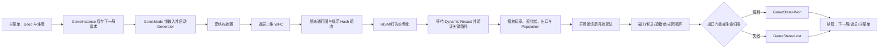

# 《零号逃亡》工程 AI 分析报告

> 初稿日期：2026-08-17；当前复核：2026-08-18
> 评审对象：当前工作区 `Source/Demo`、`Demo.uproject`、`Config`、关键 `/Game/ZeroEscape` 资产依赖与 Git 历史
> 评审方法：静态阅读工程代码与规范、梳理模块和业务链路、UE 5.8 官方 MCP 只读核对关键资产依赖、回看 Git 架构演进
> 评审重点：项目内容、工程分层、模块职责、依赖方向、耦合控制、开发规范与代码设计质量
> 证据边界：本次是工程结构分析，没有重新运行构建或 PIE；当前工作区仍有正在开发的 HUD/GameFlow 改动。

---

## 1. 工程概览

| 项 | 内容 |
|---|---|
| 游戏 | 《零号逃亡》：第三人称 3D 物理追逐动作游戏 |
| 引擎 | Unreal Engine 5.8（开发中由 5.7.4 升级） |
| 两大命题技术 | 运行时程序化内容生成（Procedural Content Generation，PCG）+ Chaos 物理玩法 |
| 项目内容 | 多层随机空间、五类机关、磁力抓取/投掷/爆裂、追猎者、能量光团、出口与完整一局流程 |
| 工程形态 | 单一 Runtime 模块内按稳定职责分层，C++ 承担规则与状态，蓝图负责资源装配和表现 |
| 开发方式 | 数据驱动、事件驱动、任务卡与 Owner 管理、方案确认后实施、构建/编辑器/运行联合验证 |
| 核心子系统 | PCG 整关生成（多层 WFC，Wave Function Collapse/波函数坍缩生成算法）、项目中的 Population（玩法对象填充阶段）、磁力抓取/投掷/爆裂、追猎者 AI 与攻击、轻/重物理受击、5 类机关、正式一局流程 |

**功能完成度**：从主菜单 Seed/难度选择 → 运行时生成多层迷宫 → 玩家/追猎者摆放 → 光团收集 → 出口门槛判胜 → 失败/重开，代码与关键资产装配已经形成闭环。历史任务记录包含分项构建和 PIE 验证；当前仍在开发中，下一步自然进入正式整局、目标机与玩家手感收口。

---

## 2. 总体结论

**这是一份远超"三周学习 Demo"预期的工程。** 它的竞争力不在某个单点算法的聪明，而在把"运行时 PCG"和"Chaos 物理受击"这两个最易失控、最难调试的系统，用一套罕见的工程纪律管住了：

- 生成算法被放在**纯值、无 World 依赖**的求解层，运行时 Actor 只负责编排、实例化与导航验收；
- **确定性被当作业务契约**：不同用途使用隔离随机子流，最终布局有规范 Hash，同一公开 Seed 对应同一地图身份；
- 角色、机关、磁力、受击和胜负状态分别由明确对象持有，跨系统通过接口、委托和纯值请求连接；
- C++、蓝图与 DataAsset 的边界清晰，项目内容可以持续增加，而不必反复改写底层生成与物理协议；
- 开发规范把方案讨论、文件 Owner、实现授权、验证和交接纳入同一工作流，使快速迭代仍保持可追溯性。

综合评价：**项目已经形成以运行时多层生成、Chaos 物理交互和追猎者玩法为核心的分层架构；关键状态、数据配置与表现装配均有明确归属，主要系统也已接入同一局业务流程。工程当前处于“核心功能集成完成、运行验收与体验表现收口”的阶段，而不是仍需补建基础架构的技术原型。** 现阶段的大型实现文件和配置整理属于后续维护工作，不影响整体结构判断。

---

## 3. 架构设计评价

### 3.1 清晰的四层分层，底层与运行时 World 解耦

工程呈现稳定的分层秩序：

| 层 | 位置 | 代表 | 特点 |
|---|---|---|---|
| 纯值求解层 | `Private/PCG/`、`Private/PCG/Population/` | `FGenerationCore`、`FWfcSolver`、`FGridLayoutSolver`、`FMultiFloorLayoutPlanner`、`FPopulationPlacementPolicy` | 静态类 + 纯值结构；不读取 World 和表现资产 |
| 运行时编排层 | `Public/PCG/`、`Public/GameFlow/` | `AZeroEscapeRuntimeLevelGenerator`、`AZeroEscapeGameMode` | Actor 生命周期、状态机、导航验收、胜败编排 |
| 玩法组件层 | `Public/Components/` | 磁力 3 件、受击 3 件、攻击、生命 | 组件独占各自状态，事件驱动 |
| 表现与配置层 | `Public/Actors/`、`Public/UI/`、`Public/Data/` | 5 类机关、5 个 Widget、14 个 DataAsset 类 | 蓝图只做装配与调参 |

值得强调的是“求解与表现分离”：`FWfcSolver` 不读取 UObject、DataAsset、World 或 StaticMesh，`FGenerationCore` 除配置解析入口外不访问 UObject。最复杂的算法层因此不受场景生命周期、素材加载和 Actor 状态影响，能够稳定地产出纯值 Plan。

### 3.2 组件优于继承，接口解耦跨角色复用

- 玩家与追猎者是**两个完全不同的类**（`AZeroEscapeCharacter` / `APursuerCharacter`），但通过**同一套组件**共享受击能力：`UHeavyImpactResponseComponent`（重冲击，92 KB 实现）、`UCharacterImpactResponseComponent`（轻受击）、`UHealthComponent`（生命）。
- 机关与角色之间不依赖具体类，而是通过两个最小接口解耦：`IHeavyImpactReceiver`（接触前准备，`Public/Interfaces/HeavyImpactReceiver.h`）与 `ICharacterImpactReceiver`（命中后提交）。机关代码里看不到任何玩家/追猎者具体类型。
- `APursuerCharacter` 的头注释直接写明定位："只负责组件装配、移动参数应用与攻击蒙太奇播放，决策交给 AI 控制器"——角色类本身保持瘦，状态被各组件独占。

这正是"组件 > 继承、接口最小化"的教科书式落地，也验证了该项目"玩家和 AI 共用受击组件而非共用父类"的架构决策（见项目长期记忆）。

### 3.3 数据驱动 + 配置自校验

每个玩法系统都有独立 Tuning DataAsset 且带运行时校验：

- `UMagneticGrabTuningData`（17 KB）、`UHeavyImpactTuningData`（10 KB）、`UPursuerConfig`（13 KB）、每个机关独立的 `*HazardTuningData`（4 个）；
- 多数资产提供 `IsConfigured(...)` 校验入口；组件在 `Configure` 阶段拒绝非法配置并**明确报错停用**，而不是带病运行。例如 `UElectromagneticGrabComponent` 注释："缺失时明确报错并停用磁力"（`ElectromagneticGrabComponent.h:157`）。

参数一律 `ClampMin/ClampMax/UIMin/UIMax` 元数据约束（如 `SpikeTrapHazard.h` 的 `RiseDuration` 下限 0.05s），杜绝了"蓝图里填个负数崩物理"的常见事故。

### 3.4 确定性设计：Seed 复现是一等公民

- `ERandomDomain` 为楼层、结构、WFC、机关和资源等用途分配互相隔离的随机子流；调整某类内容不会无关地扰动整张地图。
- WFC 回溯只推进候选下标、不重新消耗 Random（`ZeroEscapeWfcSolver.cpp` 的 `FWfcDecision` 设计），使"布局、尝试数、回溯数都可复现"。
- `FZeroEscapeGenerationCore::ComputeCanonicalLayoutHash` 对稳定空间字段计算 63 位 Hash，"排除表现资源和浮点 Transform"——验证同 Seed 复现有了可机器断言的工具。
- 分层随机域隔离同样用于 Population："资源随机域必须与机关随机域独立"（`CHALLENGE_DESIGN.md`），调资源不出重洗机关。

### 3.5 状态 Owner 单一化

几乎每个文件头注释都声明"状态 Owner：谁独占写什么状态"，且落实为代码结构：

- `AZeroEscapeGameState` 是"本局 RoundState 的唯一持有者"，胜/负只经 `TransitionTo` 单向转移，防重复与互覆盖（`ZeroEscapeGameState.h:93-95`）；
- `UMagneticObjectComponent` "是单个道具正式投掷碰撞事务的唯一写入者；消费者只能监听原生命中委托"（`MagneticObjectComponent.h:7`）；
- GameMode "不求解 PCG、不接管追猎者 AI"；AI 控制器"不拥有感知丢失或攻击冷却状态"。

这种"每个状态只有一个写入口"的纪律，直接消除了并发/异步/回调环境里最难查的共享状态竞争。

### 3.6 异步开局用"纯值 Gate"化解回调竞态

运行时生成是跨帧异步流程（生成 → 实例化 → 等动态 Recast → 导航验收），最容易出现旧操作回调、重复终态和 EndPlay 后回调。工程的处理方式是抽出纯值策略类 `FGameSetupGate`，把“这份最终报告能否被接受”收敛为一个明确判断。竞态规则因此可枚举、可复核，而不是埋在 GameMode 回调里靠时序运气。

---

## 4. 代码质量评价

### 4.1 契约式注释与责任边界

工程大量使用“职责 / 边界 / 状态 Owner”三段式头注释。例如 `HealthComponent` 明确只拥有生命数值，不处理死亡流程、UI、再生或失衡；`GameMode` 明确只编排开局与结束，不求解 PCG、不接管追猎者 AI。这些注释的价值不在覆盖率，而在于它们与类的真实职责一致，形成可检查的设计契约。

### 4.2 防御性编程分层策略

断言和错误处理使用有明显分层：

- **外部输入**：`if + OutError` 温和拒绝并写入结构化失败报告；
- **内部不变量**：`checkf` 硬断言，如"不得计算空 WFC Domain 的熵"（`ZeroEscapeWfcSolver.cpp:501`）、"非空 WFC Domain 必须至少包含一个正权重 Variant"（:517）；
- **配置错误**：独立于回溯，明确注释"不得用回溯掩盖"（`EWfcCollapsedCandidateVerdict::FatalError`）。

求解器还做了 int64 防溢出、先静态校验后 checkf（`BuildAndValidateDenseConstraintView`），以及 1024 格/64 轴/25000 次回溯等运行时安全上限（`ZeroEscapeGenerationTypes.h` 的 `ZeroEscape::GenerationLimits`）。

### 4.3 失败报告结构化，游戏逻辑不解析文本

`FZeroEscapeGenerationReport` 携带枚举化的 `Stage`、`Failure`、`ActualValue`、`LimitValue`、`RelatedStableId` 与分阶段 `Metrics`（`ZeroEscapeGenerationTypes.h:576-607`），并注明"游戏逻辑不得解析此文本"。WFC 的每次矛盾还细分 `LocalAdjacency/Count/MaxConsecutive/Connected/GlobalBan` 五类来源并各自计数——搜索爆炸时能直接定位是哪条约束在烧预算。这是把"可观测性"做成数据结构的做法，而非散落的日志。

### 4.4 结构化失败与运行时可观察性

生成系统不仅输出成功/失败，还记录失败阶段、限制值、关联结构和各阶段指标；追猎者、磁力、HeavyImpact、GameFlow 与机关也分别使用独立日志语义。调试时可以沿业务阶段定位“配置、求解、实例化、导航、玩法接入”中的具体断点，而不需要从一份混杂日志中猜测原因。

### 4.5 事件驱动与性能意识

工程默认关闭 Tick，优先使用碰撞、委托、Timer、Timeline 和状态变化驱动。只有连续物理跟随或运动表现确实需要逐帧更新时才启用 Tick，磁力组件还会把更新限制在持有阶段。这种做法不是为了追求指标，而是让运行成本与玩法状态直接对应。

### 4.6 生命周期与资源安全

- UObject 引用使用 `TObjectPtr/TWeakObjectPtr` 表达所有权和易失关系，外部 Actor/Component 不被当作永久有效对象保存；
- Timer、委托、Montage 回调、导航等待和异步恢复事务都在 `EndPlay` 或取消路径中清理；
- 生成与 Population 采用“成功后原子提交、失败时清空本次对象”的策略，避免半成品场景继续进入玩法；
- Runtime 模块不引入 Editor-only 模块，编辑器 MCP 与工具集保持在开发工具层。

---

## 5. 开发规范如何保护工程质量

### 5.1 先确认职责，再进入实现

项目要求功能先讨论目标、非目标、状态唯一管理者、C++/蓝图/数据边界和完整文件范围，再由用户确认方案并授权实现。这一规范直接反映在代码结构中：新玩法通常先形成独立组件、接口或 DataAsset，而不是临时堆进 Character 或 GameMode。

### 5.2 单一实现 Owner 与 Git 基线

实现文件同一时间只允许一个 Owner 修改；首次落盘前记录 HEAD 与工作区状态，确认既有实现改动已经形成可验证基线。纯文档可以并行，但不得修改、暂存或提交其他 Owner 的实现文件。这套规则减少了多会话、多 AI 在同一工作区互相覆盖的风险。

### 5.3 C++、蓝图和数据各自负责什么

- C++：玩法规则、状态机、接口、生命周期、安全边界和性能关键路径；
- Blueprint：角色/机关资源装配、Widget 布局、关卡配置和 AnimBP 连线；
- DataAsset：难度、生成、追猎者、磁力、受击和机关调参；
- 关卡：只提供正式入口、生成器/Populator 实例和必要的世界配置。

这条边界避免了“逻辑一半在蓝图、一半在 C++、参数又散在关卡”的常见维护问题。

### 5.4 验证按层次进行

项目明确区分源码/构建、自动化、蓝图编译与保存、编辑器回读、PIE 运行和玩家手感。测试在这里是保护纯值契约的辅助工具，不是项目成果本身；真正的完成标准仍是正式场景中的业务闭环和玩家体验。

---

## 6. 项目内容与业务结构

项目内容不是若干孤立技术演示，而是围绕“生成空间中的物理追逐逃亡”形成了一条统一业务主线：

| 内容域 | 玩家体验 | 工程承载 |
|---|---|---|
| 多层随机空间 | 每局地图结构不同，但同 Seed 可复现 | Generation Profile、宏结构规划、逐层 WFC、跨层通行图、Presentation Profile |
| 物理机关 | 地刺、摆锤、冲锤、刺轮和制导发射器形成路线压力 | 独立 Hazard Actor + Tuning DataAsset + 轻/重受击接口 |
| 磁力玩法 | 抓取、吸取、持有、投掷与爆裂是玩家主动能力 | Grab/Object/Break 三个职责分离的组件与物理替身 Actor |
| 追猎者 | 持续追击、近战和跑跳攻击迫使玩家移动 | AIController 负责决策，AttackComponent 负责攻击事务，Character 负责装配 |
| 奖励与出口 | 支线光团既补充能力资源，又构成出口门槛 | Population 放置、EnergyOrb Actor、GameState 目标、ExitVolume |
| 一局流程 | 菜单选 Seed/难度，进入生成关卡，胜负后重开或换局 | GameInstance、GameMode、GameState、PlayerController 与复用 Widget |

这些内容共享同一空间拓扑、受击协议、状态来源和一局流程，因此“生成、物理、AI、奖励、出口”能够互相产生玩法意义，而不是并列存在。

---

## 7. 做得好的地方（亮点清单）

1. **纯值求解层与引擎表现层分离**：WFC、多层规划与 Population 的选择策略不依赖 World 或表现素材，运行时 Actor 只消费最终 Plan。这是本工程最根本、最值得复用的架构决策。
2. **确定性被设计成业务契约**：不同用途使用隔离随机子流，回溯不随意重取随机，最终布局有规范 Hash；公开 Seed 因而真正代表一张地图，而不是一次不可追溯的运行结果。
3. **组件 + 接口的复用设计**：玩家与追猎者两个异构类共用受击/生命组件，机关与角色间仅以两个最小接口耦合，全部通过 `Configure` 显式注入而非按名字查找——避免了一大类"组件名写错全崩"的脆弱设计。
4. **状态 Owner 单一化纪律**：从 GameState 的胜败、磁力的投掷事务到 WFC 的 Domain 变化，每个状态都有唯一写入口，头注释即契约。异步开局竞态还抽成可复核的纯值 Gate。
5. **结构化失败与可观测性**：生成报告枚举化 + 分阶段指标 + 矛盾来源分类计数，WFC 搜索爆炸可以定位到"哪条约束烧光了预算"；游戏逻辑不解析日志文本。
6. **验证策略分层**：纯值契约、编辑器资产、运行时导航、物理表现和玩家手感分别验证，不把“编译通过”误写成“玩法完成”。
7. **事件驱动符合业务状态**：只有连续物理跟随才使用 Tick，其余流程由碰撞、委托、Timer、Timeline 和状态变化驱动。
8. **契约式注释服务于维护**：职责、边界和状态 Owner 在类声明处说清楚，新功能是否越界很容易判断。
9. **生命周期处理完整**：弱引用、Timer/Delegate 清理、事务序号和原子失败处理共同降低悬挂回调与半成品状态风险。
10. **工程记录与代码同步**：任务卡、设计文档、DailyPlan/DailyReport、Git 基线与项目记忆共同保留“为什么这样设计、如何验证、下一步是什么”。

---

## 8. 开发阶段的后续收口建议

这些都是“继续开发时顺手收口”的方向，不影响当前工程的正面评价，也不建议现在为了形式整洁打断玩法迭代：

1. **优先完成正式一局验收**：把动态 Recast、真实跨层追逐、机关/光团/出口、死亡/重开和 HUD 放在同一局中验证，比继续做架构重构更有回报。
2. **继续保护状态 Owner**：后续 HUD、音频、提示和新机关只读取既有状态或订阅委托，不把新的权威状态放进 Widget、GameMode 或关卡蓝图。
3. **功能稳定后再整理大型实现**：多层规划、Population 与 HeavyImpact 已有清晰阶段；长期维护时可以按阶段抽内部协作者，短期不必为拆文件打断体验收口。
4. **做一次发布前依赖与配置清单**：统一渲染基线、输入配置和内容包依赖，确认正式 Cook 只包含成品需要的资产。
5. **补齐音画反馈与目标机体验**：脚步、机关预警、磁力操作和出口反馈会比继续增加底层系统更直接地提升完成度。

---

## 9. 技术栈与依赖关系

### 9.1 运行时技术栈

| 领域 | 当前采用 | 工程角色 |
|---|---|---|
| 引擎与语言 | Unreal Engine 5.8、C++ 优先、Blueprint 装配 | 核心规则与状态在 C++；蓝图负责资源、UI、AnimBP 与关卡实例 |
| 输入 | Enhanced Input | Mapping Context 与 Input Action 由 `UZeroEscapeInputConfig` 集中引用 |
| UI | UMG + Slate/SlateCore | 菜单、暂停、结算和 Gameplay HUD；Canvas HUD 保留轻量准星 |
| AI | `AAIController` + Timer 状态机 + `MoveToActor` | 不使用行为树；攻击阶段交给 `UPursuerAttackComponent` |
| 导航 | NavigationSystem + Dynamic RecastNavMesh | 生成完成后等待动态导航构建，并用追猎者代理参数验证关键路径 |
| 物理 | Chaos 刚体、Physics Handle、Physics Control、Geometry Collection | 磁力抓取、轻/重受击、抛射机关与破碎表现 |
| 程序化生成 | 项目自研运行时关卡生成器 | 注意：这里的“PCG”是项目内部对程序化生成的称呼，未依赖 UE 官方 PCG Framework 模块 |
| 数据配置 | `UDataAsset` / `UPrimaryDataAsset`、软类/软对象引用 | 难度、生成、表现、Population、角色和机关参数 |

`Demo` Runtime 模块依赖输入、AI、导航、UMG、Physics Control 与 Geometry Collection 等直接服务于核心玩法的 UE 模块。没有引入 GAS、OnlineSubsystem 或网络复制框架，符合单机短周期 Demo 的范围控制。

### 9.2 项目插件、工具与内容依赖

- 运行时关键插件是 Physics Control；本地 `UEEditorMCP` 与官方 Model Context Protocol/Editor Toolset/Automation Toolset 等属于编辑器协作和自动化能力，没有进入 `Demo` Runtime 模块依赖。
- 官方 MCP 资产图确认：`BP_ZeroEscapeGameMode` 是主要装配根，连接玩家、追猎者、GameState、PlayerController、出口与结算 UI；Generator 蓝图连接 Generation Profile 与 Presentation Profile；Population Profile 连接五类机关、磁力物和能量光团。
- 主要内容包依赖包括 SciFiHydroLab 场景网格、SFCorridors 道具、两套科幻角色资产和斧头资产。它们被限制在表现 Profile 或 Blueprint 装配层，核心求解代码不直接引用这些素材。
- 当前桌面渲染目标为 DX12/SM6、Scalable 配置；启用 Lumen 动态全局光照与 Mesh Distance Fields，关闭硬件光追、Virtual Shadow Maps、Substrate 与 Sorted Pixels OIT。发布前只需用目标机性能测试统一配置与规范文字。

综合判断：**依赖选择与项目目标匹配，运行时依赖克制，第三方内容主要停留在表现层；开发工具较多但与玩法模块基本隔离。**

---

## 10. 模块划分与耦合度

### 10.1 模块职责与主要协作关系

| 子系统 | 核心职责 | 主要输入 | 主要输出/下游 | 耦合判断 |
|---|---|---|---|---|
| PCG | 生成多层空间、实例化结构、验收导航 | Seed、难度、Generation/Presentation Profile | 最终 Plan、出生点、出口点、Population 快照 | 内部聚合高，对外接口集中 |
| Population | 在已验证空间中放置机关、磁力物和光团 | Generator 的只读快照、Population Profile | 本局玩法 Actor 集合 | 只依赖生成结果，不反向影响地图合法性 |
| Characters | 角色移动、相机、输入转发和组件装配 | Input Config、角色 DataAsset | 磁力/受击/攻击组件入口 | 组合入口，业务状态较少 |
| Components | 磁力、生命、攻击、轻/重受击事务 | 纯值请求、DataAsset、碰撞/输入事件 | 委托、状态变化、物理结果 | 项目主要复用层 |
| Hazards/Items | 将场景接触转换为玩法请求 | 独立 Tuning DataAsset、目标接口 | 伤害、轻/重受击、收集请求 | 不依赖具体玩家或 AI 类型 |
| AI | 追逐与攻击选择 | Pursuer Config、目标距离、导航状态 | MoveTo 与攻击请求 | 决策与攻击执行分离 |
| GameFlow | 编排开局、目标、胜负与重开 | 生成报告、生命与出口事件 | GameState 转移、UI/输入模式 | 业务协调中心，但不拥有底层算法状态 |
| UI | 展示资源、目标、菜单和结算 | GameState 与组件只读状态、委托 | 用户意图 | 只展示或转发，不持有玩法真相 |

### 10.2 依赖方向

Public Header 的跨子系统依赖方向比较单纯：

- `Actors/Characters → Interfaces/Components`：机关和角色通过最小协议与组件协作；
- `Components → Data/Physics Types`：运行时执行读取独立配置与共享纯值请求；
- `GameFlow/UI → PCG Types`：菜单保存 Seed/难度，GameMode 消费生成报告；
- `PCG Runtime → AI Navigation Types`：只为追猎者导航代理与 Recast 验收服务。

`Components` 是主要复用中心，`PCG` 的内部求解类型大部分留在 Private 目录。GameFlow 与 UI 在实现层协作较多，但公开接口没有形成大面积环状依赖。蓝图层以 GameMode、Generation Profile、Population Profile 为装配根，把素材依赖留在 C++ 业务边界之外。

**耦合度结论：逻辑耦合低到中等，物理模块耦合中等。** 单一 Runtime 模块意味着编译/发布仍整体绑定，但目录、接口、纯值类型和 DataAsset 已提供清晰的逻辑模块化。对于三周 Demo，这是比提前拆多个模块更务实的选择。

---

## 11. 核心业务流程

### 11.1 一局生成与开局

1. 菜单 Widget 采集公开 Seed 与难度，写入 `UZeroEscapeGameInstance`；Seed 是地图身份，生成失败不会静默改写。
2. `AZeroEscapeGameMode` 锁定输入，查找唯一 Generator/Populator，配置追猎者导航代理并提交请求。
3. `FGenerationCore` 将 DataAsset 解析成不可变纯值输入；`FMultiFloorLayoutPlanner` 先放完整楼梯/高厅等宏结构，再调用 `FGridLayoutSolver/FWfcSolver` 完成逐层二维布局，最后合并跨层通行图。
4. `FStructureBuilder` 把通过验收的 Plan 展开为 HISM、结构件与灯光；Generator 等待目标 Dynamic RecastNavMesh 完成，并验证玩家、追猎者、出口、楼梯等关键地址的路径。
5. GameMode 只在最终成功报告到达后摆放角色/出口、初始化生命、执行项目中的 Population 放置阶段、建立光团目标，随后播放开场镜头并解锁输入。旧操作、重复终态和 EndPlay 后回调由纯值 Gate 过滤。

### 11.2 玩法循环

- 玩家通过磁力组件完成选取、吸取、持有、投掷与爆裂；磁力物组件独占一次正式投掷事务，破碎组件只负责替换表现。
- 机关通过 `ICharacterImpactReceiver` 或 `IHeavyImpactReceiver` 提交轻/重受击请求，不依赖玩家或追猎者具体类。
- 追猎者控制器以低频 Timer 负责追逐与攻击选择，攻击组件独占起手、命中、恢复和取消，角色类只做组合与接口转发。
- 能量光团由 GameState 维护收集进度，同时补充爆裂次数；出口未满足门槛时保持锁定，满足后才允许 GameState 转入胜利。

### 11.3 结束与重开

`AZeroEscapeGameState` 是胜负唯一真相源，只允许从 `InProgress` 单向进入 `Won/Lost`。GameMode 响应状态变化完成胜利/失败表现与结算 UI；Result/Pause/LevelSetup Widget 复用同一套 Seed/难度选择流程，最终回到新一局请求。

---

## 12. 版本演进历史

Git 历史显示项目从 2026-07-18 初始化到当前版本，始终沿着“先建立可玩原型，再逐步形成稳定业务边界”的方向演进：

| 阶段 | 代表演进 | 工程意义 |
|---|---|---|
| 07-18～07-22 | 建立 UE 工程、AI 协作规范、磁力玩法基线 | 先形成可玩交互与工作流边界 |
| 07-23～07-27 | PCG/WFC 原型、UE 5.7.4 → 5.8 升级、灯光与出口 | 完成单层空间生成基础，并保留升级前后快照 |
| 07-31～08-04 | 正式 GameFlow、结算/暂停 UI、多层 PCG | 从技术原型转成一局游戏；宏结构 + 逐层 WFC 架构成型 |
| 08-05～08-10 | HeavyImpact、物理机关、起身恢复、站立轻受击 | 物理从单次效果演进为可恢复、可复用状态机 |
| 08-11～08-13 | 磁力破碎、Population、追猎者跑跳攻击、Seed 稳定 | 玩法内容与确定性生成开始联动 |
| 08-14～08-16 | 情境化机关、奖励支线、300cm 机关站、光团/出口/生命 | 从“能生成”提升到节奏、奖励与胜负闭环 |
| 08-17～08-18 | 传送门、Gameplay HUD、开场运镜与回合结束表现 | 进入演示呈现和体验收口阶段 |

历史演进也反映了架构成熟过程：早期集中式生成实现被替换，当前形成 `GenerationCore → MultiFloorLayoutPlanner → GridLayoutSolver → WfcSolver → Presentation/Population` 的分层；HeavyImpact 与 Population 则在频繁实机反馈中逐步加入边界、恢复和可观测性。

版本演进最明显的特点不是提交频率，而是每次重构都在收紧职责：生成从集中式求解器拆成多层规划、逐层 WFC、表现与 Population；物理从单次冲量演进为准备、提交、倒地、恢复的事务；GameFlow 从测试关卡规则扩展为菜单、目标、胜负和重开的正式一局。这说明架构是在真实玩法反馈中逐步成型，而不是脱离内容预先设计。

---

## 13. 综合评估

| 维度 | 评价 | 依据 |
|---|---|---|
| 项目内容 | 完整且统一 | 生成空间、物理机关、磁力、追猎者、奖励、出口与胜负围绕同一逃亡循环协作 |
| 核心业务 | 清晰 | 从选择 Seed/难度到生成、追逐、收集、出口、死亡与重开形成完整主链 |
| 架构清晰度 | 强 | 纯值求解、运行时编排、玩法组件、数据/表现装配分层明确 |
| 模块划分 | 良好 | PCG、Population、物理、AI、GameFlow、UI 各有稳定职责，Character 只做组合入口 |
| 耦合控制 | 良好 | 接口、委托、纯值请求和 DataAsset 取代具体类型、对象名和资源路径依赖 |
| 开发规范 | 强 | 方案确认、Owner、Git 基线、分层验证与交接记录能够约束快速迭代 |
| 代码质量 | 强 | 状态唯一管理者、原子失败、生命周期清理、结构化错误和事件驱动贯彻一致 |
| 当前阶段 | 体验收口中 | 工程主链已经成型，重点转向正式整局、目标机、音画反馈和玩家手感 |

总体上，这是一个**以技术难点为核心、又已经跨过“纯技术原型”阶段的高质量开发中 Demo**。它最有价值的地方不是规模指标，而是复杂系统之间已经形成可解释、可维护、可回退的边界：PCG 能复现，物理受击能恢复，玩法对象通过接口接入，胜负状态有唯一来源。

---

## 14. 结论

《零号逃亡》的代码工程在“三周单机 Demo”这个前提下是**超预期的高完成度作品**：它证明了在时间压力下，真正保护项目的是**纯值求解与运行时编排分层、Seed 确定性、单一状态 Owner、明确的 C++/蓝图/数据边界和分层验证**——两大高难度系统（运行时 PCG、Chaos 物理受击）正是在这套纪律下被持续交付和迭代。

对评审命题（技术能力、完整性、AI 协作）而言，本工程的证据来自系统之间真正形成了业务协作：自研多层网格 WFC 产出可追逐空间，动态导航把空间转成 AI 可用关卡，磁力与机关共享受击协议，追猎者与奖励系统共同塑造路线选择，GameFlow 再把这些内容收束成完整一局。技术不是并列陈列，而是在同一玩法闭环中互相支撑。

下一阶段最值得做的不是大改架构，而是完成正式一局与目标机验收、补齐关键音画反馈，再在功能稳定后做少量内部整理。以当前开发阶段看，工程底座已经足以支撑答辩、演示和后续玩法收口。
